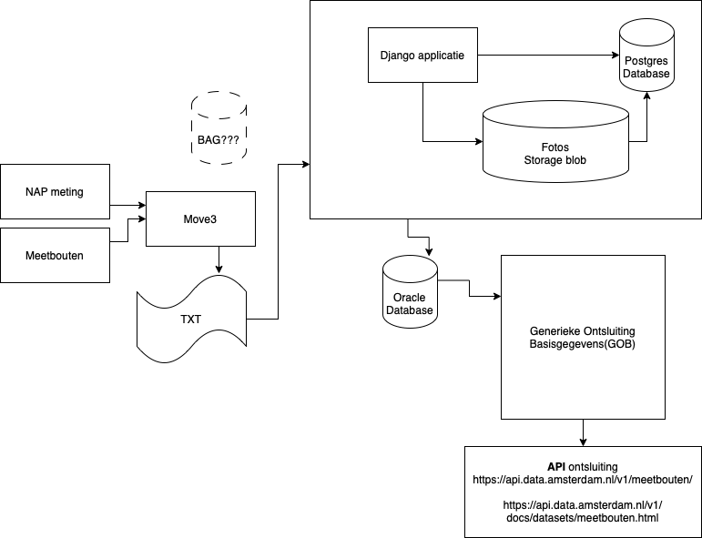
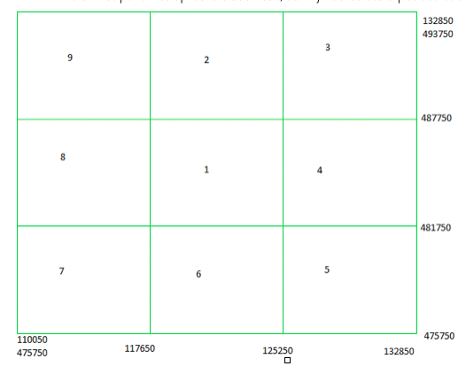
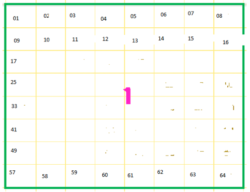

# Meetbouten

Bewaking verzakkingen middels meetpunten op gebouwen en straat-elementen.
De applicatie beheert landmeetkundige grondslag xy, NAP- bouten, referentiebouten en deformatiebouten  in een ruimtelijke database. Grondslagpunten en hoogtebouten kunnen worden toegevoegd, gemuteerd of geraadpleegd. Er wordt ook historie bijgehouden van de hoogtebouten. Foto’s van de grondslagpunten en foto’s en **grafieken van de hoogtebouten** kunnen worden getoond. Tevens is het mogelijk **resultaten van waterpassingen te vergelijken met de grondslagdatabase** en worden er **invoerbestanden voor het vereffeningspakket MOVE3 van de Grontmij aangemaakt.** De resultaten van NAP-metingen en deformatiemetingen (meetboutengis) worden ontsloten via Generieke Ontsluiting Basisgegevens (GOB) bij Datapunt.

### Technische eigenschappen

NAP heeft een Client op ADW waarmee de meetresultaten rechtstreeks in de Oracle Database  (DB) geschreven worden en foto’s op een centrale netwerkschijf  opgeslagen. In de DB staan harde paden naar de foto’s op de centrale netwerkschijf.
GOB raadpleegt de NAP DB. **Functioneel Beheer (FB) werkt rechtstreeks op de DB middels SQL-Developer.** Er is een Test, Acceptatie en een Productie omgeving.

### Beschrijving meetbout nummering

Een puntnummer bestaat altijd uit 8 cijfers en is uniek (1238x456)

#### 1e 3 posities 

Is het bladnummer, gebaseerd op de XY-coördinaten. Zie hiervoor de kaartbladnummers in /src/metingen/files

#### Pos. 4 

Altijd een 8 in geval van een NAP/meetbout

#### Pos. 5 

Afhankelijk van het type bout (0=NAP; 8=ondergronds; 9=referentie; 1 of 2=deformatie)
Pos 6 t/m 9 is volgnr (ophoging van het laatste nummer van het blad-type)
Het bereik van nummering voor een deformatiebout is 1000 t/m 2999 (incl pos 5)

#### Bladnummer
1e positie is het hoofdbladnummer,
Indien het punt op blad 1 valt is de eerste pos een 1, blad 2 een 2, enz.
Indien het punt niet op deze bladen valt, dan zijn de eerste 3 posities 000 (3 nullen)

2e en 3e positie is (icm de eerste positie) het kaartbladnummer
Een hoofdblad is onderverdeeld in 64 kaartbladen
Een kaartblad heeft een afmeting van 950m x 750m

#### Volgnr (posities 6 t/m 9) bij een nieuw op te voeren NAP/meetbout
Het nieuwe nummer wordt de eerstvolgend nummer wat beschikbaar is in de reeks.

#### Voorbeeld
Als een nieuwe NAP-bout op blad 125 ligt, dan wordt gezocht wat het laatst gebruikt nummer is voor een NAP-bout op dat blad. Als het laatst gebruikte nummer op dat blad is 12580003, dan krijgt het nieuwe NAP-bout het nummer 12580004
